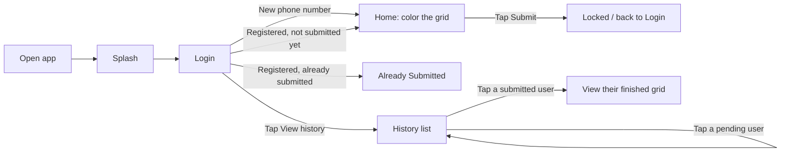
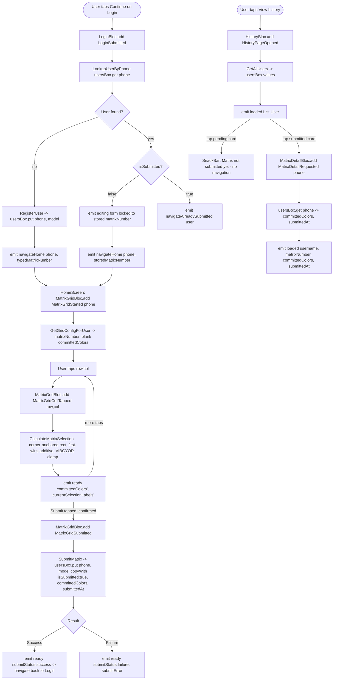

# Matrix Application — Feature Development Plan
### Splash → Login/Registration → History → Matrix Grid (Home) → Matrix Detail

Produced following the architecture rules in [.claude/commands/feature-flutter-plan.md](.claude/commands/feature-flutter-plan.md) (Clean Architecture + `flutter_bloc` + Hive + `go_router` + `get_it`/`injectable`), as requested.

---

## Context

`matrix_application` is currently a completely fresh, unmodified `flutter create` scaffold — [lib/main.dart](lib/main.dart) is the stock counter-app boilerplate, [pubspec.yaml](pubspec.yaml) has only `cupertino_icons` + `flutter_lints`, and there is no `lib/core`, `lib/features`, `docs/`, or `design/` folder anywhere in the repo (confirmed by direct read). This plan is the from-scratch build of the app's entire first release: a user registers with a username, phone number, and a "matrix number" (2–20), then paints an N×N grid of boxes with a VIBGYOR color scheme by tapping cells, and submits the result once — permanently locking that user's task. A history screen lets anyone browse every registrant and review a submitted user's final grid.

Since no third-party packages are installed yet, this plan includes a mandatory **Step 0 — setup** (per the command's own "Before you start" rule 4) listing every `pubspec.yaml` addition needed before any feature code is written.

**Source studied:** no `docs/`/`design/` folder exists in this repo (confirmed) — there is no PRD/Figma source. Requirements below are taken verbatim from the user's own request (quoted in Step 1b) and disambiguated through a clarifying Q&A (results captured inline in Step 4/5/10). All copy strings, color values, and spacing in this plan are therefore **proposed by this plan**, not sourced from a design file, per Rule 15 — treat them as a first draft for stakeholder sign-off, not final content.

---

### Step 1 — What is the feature

**a. High-level description.** A registration + task app built around a colored grid. A user signs up with their name, phone number, and a "matrix number" (the size of their personal grid, 2–20). On first login they land on a grid of that size and color it in by tapping cells — each tap paints a rectangular block of boxes using a seven-color (VIBGYOR) rainbow pattern. Once they hit Submit, their grid is locked forever and marked "submitted." A History screen lets anyone see every user who has registered, whether they've submitted yet, and — for those who have — the exact grid they submitted.

**b. Source citation (user's request, verbatim):**
> "Step 1: Create a splash screen. Step 2: Login screen in this user name, phonenumber and matrix numbers required fields if user not exist then register and redirect home screen if already register and not submitted task then redirect home screen and if submitted task then show a screen you have already submitted task, In login screen also a history button click this show a listpage of users matrix number and submitted or not submitted like that. Step 3: In home screen according to matrix number create n*n number of boxes if i boxes click like that if i click 3rd row 3 column box then starting area to end box colors changes and max col is col and max row is max row. Color condition VIBGYOR colors... And one things box counting show only current time selected area and if i have select 5*6 then colored and after that select 2*2 then just numbers show small area and large area colors also saved. And one submit button using this save our colored boxes same as same and in history page same matrix save show in history details users cards clicked. For localstorage used hive."

**c. Status:** **New** — no code exists for any of this yet.

---

### Step 2 — Screens

| Screen | Route (path / name) | File | Bloc | New/Existing |
|---|---|---|---|---|
| Splash | `/splash` · `AppRoute.splash` (initial route) | `lib/features/splash/presentation/screens/splash_screen.dart` | none (fixed-delay timer only) | New |
| Login / Registration | `/login` · `AppRoute.login` | `lib/features/auth/presentation/screens/login_screen.dart` | `LoginBloc` — `lib/features/auth/presentation/bloc/login_bloc.dart` | New |
| Already Submitted | `/already-submitted` · `AppRoute.alreadySubmitted` | `lib/features/auth/presentation/screens/already_submitted_screen.dart` | none — receives fully-loaded `User` via `GoRouterState.extra` | New |
| History | `/history` · `AppRoute.history` | `lib/features/auth/presentation/screens/history_screen.dart` | `HistoryBloc` — `lib/features/auth/presentation/bloc/history_bloc.dart` | New |
| Home (interactive grid) | `/home/:phone` · `AppRoute.home` | `lib/features/matrix_grid/presentation/screens/home_screen.dart` | `MatrixGridBloc` — `lib/features/matrix_grid/presentation/bloc/matrix_grid_bloc.dart` | New |
| Matrix Detail (read-only) | `/history/detail/:phone` · `AppRoute.matrixDetail` | `lib/features/matrix_grid/presentation/screens/matrix_detail_screen.dart` | `MatrixDetailBloc` — `lib/features/matrix_grid/presentation/bloc/matrix_detail_bloc.dart` | New |

**Responsive / platform-adaptive notes (applies to all six):** every screen wraps content in `SafeArea`; the grid screens (Home, Detail) use `LayoutBuilder` so cells stay square and shrink to fit N up to 20 on the smallest supported phone width, with the grid itself scrollable if cells would otherwise drop under the 44×44 logical-px minimum tap target; forms (Login) sit in a `SingleChildScrollView` so the keyboard never clips a field. `PrimaryButton`/`AppTextField` core widgets use `.adaptive`-style platform branching (Cupertino-flavored on iOS, Material on Android); `PageTransitionsTheme` is set per-platform in `app_theme.dart`. Each screen ships a widget test; Home, Matrix Detail, History, and Login (its validation-error state) additionally get golden tests across light/dark × iOS/Android (Step 11b) — Splash and Already-Submitted are low-complexity enough that a plain widget test is sufficient.

**b. Screen → source mapping** — no design file exists (Step 1b's quote is the only source); copy strings below are this plan's own proposal:

| Screen | Copy strings proposed (verbatim to implement) |
|---|---|
| Login | Field labels: "Username", "Phone number", "Matrix number"; primary button "Continue"; link "View history"; validation: "Enter your name", "Enter a valid phone number", "Enter a number between 2 and 20" |
| Already Submitted | Heading "You've already submitted your task"; subtitle "Submitted on {date}"; button "Back to login" |
| History | Title "Submission history"; empty state "No registrations yet"; status chip text "Submitted" / "Pending"; toast on tapping a pending user "Matrix not submitted yet" |
| Home | Live counter "{rows} × {cols} = {count} boxes"; button "Submit"; confirm dialog "Submit matrix?" / "This can't be undone." |
| Matrix Detail | Subtitle "Submitted on {date}" |

---

### Step 3 — User Journey (Mermaid)



---

### Step 4 — Data layer schema

> One Hive model, one box, covers the whole app — a user's registration data and their final submitted grid are the same aggregate.

**a. Hive model — `lib/features/user/data/models/user_model.dart`** — `@HiveType(typeId: HiveTypeIds.user)` (typeId `0`, registered in `lib/core/storage/hive_type_ids.dart`), box `usersBox` (`lib/core/storage/hive_box_names.dart`):

| Field | HiveField | Type | Constraints | Purpose |
|---|---|---|---|---|
| phoneNumber | 0 | `String` | required, numeric, Hive **key** | Unique login identity |
| username | 1 | `String` | required, non-empty | Display name |
| matrixNumber | 2 | `int` | 2–20, fixed at first registration | Grid size (N×N) |
| isSubmitted | 3 | `bool` | default `false` | Gates Login/History branching |
| createdAt | 4 | `DateTime` | required | Registration timestamp |
| submittedAt | 5 | `DateTime?` | null until submit | Shown on Already-Submitted / Detail |
| committedColors | 6 | `Map<String, int>?` | null until submit; key `"row_col"`, value band index 0–6 | The final colored grid |

`Map<String, int>` is natively supported by Hive's binary reader/writer (no custom sub-adapter needed) — confirmed against current Hive CE codegen behavior; the generated adapter casts it back with `(fields[6] as Map?)?.cast<String, int>()`. Worth a one-time glance at the generated `.g.dart` file after the first `build_runner` run.

`UserModel` is a **plain annotated class**, not `@freezed` — mixing Hive codegen with freezed constructors is a known friction point. The pure-Dart `User` entity (`lib/features/user/domain/entities/user.dart`) is the `@freezed` value type used everywhere above the data layer; `UserModel.toEntity()`/`fromEntity()` map between them in `user_repository_impl.dart`.

**b. Remote DTO:** N/A — the app is fully offline, no backend/API exists or is planned.

**c. Domain entity:** `lib/features/user/domain/entities/user.dart` — freezed class mirroring the table above (using the pure-Dart `User`, not the Hive model, throughout `domain`/`presentation`).

**d. Box registration:** `usersBox`, **not encrypted** (Rule 3 only requires encryption for tokens/PII-sensitive auth data; this app stores a name/phone/matrix-number with no password or session token). Opened exactly once, in `lib/features/user/data/datasources/user_local_datasource.dart`, during `hive_initializer.dart`'s startup sequence.

**e. Caching strategy:** N/A (no network layer to reconcile against) — Hive is the only source of truth; every read/write is local-first and synchronous-fast.

**f. Migration plan:** none needed yet — all fields are present from the first version. Future additive fields get adapter defaults; a breaking change would need a versioned `usersBoxV2` + one-off migration function, per Rule 3.

---

### Step 5 — State management design (BLoC)

**a. New blocs**

| Bloc | Events | States (freezed union) | Use case(s) called | Screen |
|---|---|---|---|---|
| `LoginBloc` | `LoginUsernameChanged`, `LoginPhoneNumberChanged`, `LoginMatrixNumberChanged`, `LoginSubmitted` | `editing(form)`, `submitting(form)`, `navigateHome(phone, matrixNumber)`, `navigateAlreadySubmitted(user)`, `submitFailure(form, message)` | `LookupUserByPhone`, `RegisterUser` | Login |
| `HistoryBloc` | `HistoryPageOpened`, `HistoryRefreshRequested` | `loading()`, `loaded(List<User>)`, `empty()`, `error(message)` | `GetAllUsers` | History |
| `MatrixGridBloc` | `MatrixGridStarted(phone)`, `MatrixGridCellTapped(row,col)`, `MatrixGridSubmitted` | `initial()`, `loading()`, `loadFailure(message)`, `ready(matrixNumber, committedColors, currentSelectionLabels, rows, cols, submitStatus, submitError)` | `GetGridConfigForUser`, `CalculateMatrixSelection`, `SubmitMatrix` | Home |
| `MatrixDetailBloc` | `MatrixDetailRequested(phone)` | `initial()`, `loading()`, `loaded(username, matrixNumber, committedColors, submittedAt)`, `error(message)` | `GetGridConfigForUser` (read path) | Matrix Detail |

Already-Submitted has **no bloc** — it's a pure display screen for the `User` object handed to it via router `extra`.

**b. Existing blocs:** none — this is a from-scratch build.

**c. Route guard application:** **none.** Per the explicit requirement ("every app open requires login," no remember-me/session), there is no persisted auth state to gate on, so `app_router.dart` has no `redirect:` callback. This absence is intentional, not an oversight against Rule 6.

**d. Cross-cutting concerns:** a single top-level `BlocListener`/`SnackBar` pattern per bloc-with-failure-states (Login submit failure, MatrixGrid submit failure) wired locally in each screen — the app has no global connectivity/session state needing a `MaterialApp`-level listener since everything is local Hive I/O.

---

### Step 6 — Routes

**a. App routes**

```
/splash                       — "Splash"                    [public]   NEW  (initial route)
/login                        — "Login / Registration"       [public]   NEW
/already-submitted            — "Already Submitted"          [public]   NEW  (extra: User)
/history                      — "Submission history"         [public]   NEW
/history/detail/:phone        — "Matrix Detail (read-only)"  [public]   NEW  (path param: phone)
/home/:phone                  — "Home (interactive grid)"    [public]   NEW  (path param: phone)
```

**b. API endpoints consumed:** N/A — fully offline app, no backend.

---

### Step 7 — Widgets

**a. New widgets**

| Widget | File | Scope | Why |
|---|---|---|---|
| `PrimaryButton` | `lib/core/widgets/primary_button.dart` | Shared (core) | Used by Login, Home, dialogs, Already-Submitted |
| `AppTextField` | `lib/core/widgets/app_text_field.dart` | Shared (core) | Used by all 3 Login fields |
| `LoadingView` | `lib/core/widgets/loading_view.dart` | Shared (core) | Used by History, Home, Matrix Detail loading states |
| `EmptyStateView` | `lib/core/widgets/empty_state_view.dart` | Shared (core) | History empty state (extensible later) |
| `ErrorStateView` | `lib/core/widgets/error_state_view.dart` | Shared (core) | History/Home/Detail error states |
| `StatusBadge` | `lib/core/widgets/status_badge.dart` | Shared (core) | History cards + Already-Submitted header |
| `MatrixLogoMark` | `lib/features/splash/presentation/widgets/matrix_logo_mark.dart` | Single-screen | Only Splash uses it |
| `LoginForm` | `lib/features/auth/presentation/widgets/login_form.dart` | Single-screen | Only Login uses it |
| `HistoryUserCard` | `lib/features/auth/presentation/widgets/history_user_card.dart` | Single-screen | Only History uses it |
| `MatrixGridView` | `lib/features/matrix_grid/presentation/widgets/matrix_grid_view.dart` | Feature-local (2 screens, 1 feature) | Shared by Home + Matrix Detail, but only within `matrix_grid` — stays feature-local, not promoted to `core/`, since no other feature needs it |
| `MatrixCell` | `lib/features/matrix_grid/presentation/widgets/matrix_cell.dart` | Feature-local | Single animated cell used by `MatrixGridView` |
| `SelectionSummaryBar` | `lib/features/matrix_grid/presentation/widgets/selection_summary_bar.dart` | Single-screen | Home only (live "R × C = N boxes") |
| `SubmitConfirmationDialog` | `lib/features/matrix_grid/presentation/widgets/submit_confirmation_dialog.dart` | Single-screen | Home only |

**b. Existing widgets:** none — from-scratch build.

---

### Step 8 — Third-party integrations

```
### hive_ce + hive_ce_flutter + hive_ce_generator
- Local persistence for the single User/Matrix aggregate (Step 4)
- New integration
- No env/config needed (no encryption key required — no PII/token box)
- Platform setup: none beyond standard Flutter (pure Dart storage, no native permissions)

### flutter_bloc + freezed + freezed_annotation
- State management for all 4 blocs (Step 5)
- New integration

### go_router
- All 6 app routes, centralized in app_router.dart (Step 6)
- New integration

### get_it + injectable + injectable_generator
- DI for repositories, datasources, use cases, and blocs
- New integration

### build_runner (dev)
- Codegen runner for Hive adapters, freezed classes, and injectable's injection.config.dart
- New integration

### bloc_test + mocktail + golden_toolkit (dev)
- Test tooling (Step 11b) — no runtime footprint
```

No Firebase/push notifications anywhere in scope — Step 8's conditional deep-dive is N/A.

---

### Step 9 — End-to-end Mermaid flow (technical)



---

### Step 10 — Bloc event handlers and per-handler logic

```
### LoginBloc — on<LoginSubmitted> (lib/features/auth/presentation/bloc/login_bloc.dart)
1. emit(submitting(currentForm)).
2. Call lookupUserByPhone(LookupParams(phone)) — one Hive read, no live debounce-per-keystroke (rejected: extra complexity/flicker for zero benefit on a single-field lookup).
3. Not found -> call registerUser(RegisterParams(username, phone, matrixNumber)) -> on Success emit(navigateHome(phone, matrixNumber)).
4. Found, isSubmitted == false -> emit(editing(form.copyWith(matrixNumberText: stored, isMatrixNumberLocked: true, infoMessage: "Using your saved matrix size"))), then emit(navigateHome(phone, storedMatrixNumber)) — the matrix number the user typed is intentionally overridden by the value fixed at first registration.
5. Found, isSubmitted == true -> emit(navigateAlreadySubmitted(user)).

Error paths:
- ValidationFailure (phone non-numeric, matrixNumber outside 2-20, empty username) -> caught before any Hive call, emit(submitFailure(form, message)) immediately.
- CacheFailure (Hive read/write failed) -> emit(submitFailure(form, "Could not reach local storage")).

### HistoryBloc — on<HistoryPageOpened> / on<HistoryRefreshRequested> (lib/features/auth/presentation/bloc/history_bloc.dart)
1. emit(loading()).
2. Call getAllUsers() -> usersBox.values -> List<User>.
3. Empty list -> emit(empty()). Non-empty -> emit(loaded(users)).

Error paths:
- CacheFailure -> emit(error("Could not load history")).

### MatrixGridBloc — on<MatrixGridStarted> (lib/features/matrix_grid/presentation/bloc/matrix_grid_bloc.dart)
1. emit(loading()).
2. Call getGridConfigForUser(phone) -> reads matrixNumber; guard: if user.isSubmitted, this path should never be reached (Login never routes a submitted user to Home) but defensively emit(loadFailure("Already submitted")) if it somehow is.
3. Success -> emit(ready(matrixNumber, committedColors: {}, currentSelectionLabels: {}, rows: 0, cols: 0, submitStatus: idle)) — grid always starts blank, no partial-progress resume.

### MatrixGridBloc — on<MatrixGridCellTapped> (row, col)
1. Call calculateMatrixSelection(row, col, currentState.committedColors) — PURE domain function (Step 4's pseudocode): builds the corner-anchored rectangle (1,1)..(row,col), labels every cell in it for the live overlay, but only assigns a new VIBGYOR band (and advances the color-sequence counter) to cells not already present in committedColors (first-wins additive merge).
2. emit(ready(...currentState, committedColors: result.committedColors, currentSelectionLabels: result.currentSelectionLabels, rows: row, cols: col)).

No error path — this is a pure in-memory calculation, nothing can fail.

### MatrixGridBloc — on<MatrixGridSubmitted>
1. emit(ready(...currentState, submitStatus: inFlight)).
2. Call submitMatrix(phone, committedColors) -> usersBox.put(phone, model.copyWith(isSubmitted: true, committedColors: committedColors, submittedAt: now)).
3. Success -> emit(ready(...currentState, submitStatus: success)) — screen listens for this and calls context.go('/login').
4. Failure -> emit(ready(...currentState, submitStatus: failure, submitError: message)) — committedColors is NOT cleared, so the user can retry Submit without losing their work.

Error paths:
- CacheFailure (Hive write failed) -> emit as above; SnackBar shown, grid state preserved.

### MatrixDetailBloc — on<MatrixDetailRequested> (lib/features/matrix_grid/presentation/bloc/matrix_detail_bloc.dart)
1. emit(loading()).
2. Read user by phone -> if not found or committedColors is null, emit(error("No submitted matrix found")).
3. Found with committedColors -> emit(loaded(username, matrixNumber, committedColors, submittedAt)) — currentSelectionLabels is never populated here, so MatrixGridView renders with zero number-overlay, exactly matching the "static review" requirement.
```

The bloc never touches Hive directly in any of the above — every Hive read/write goes through `UserLocalDataSource` via the use cases and `UserRepositoryImpl`, per Rule 2.

---

### Step 11 — Output feature folder structure

**a. Feature-boundary call:** a new **`lib/features/user/`** module (data + domain only, **no presentation**) holds the shared `User` entity/repository/use-cases, because both `auth` (Login/History/Already-Submitted) and `matrix_grid` (Home/Detail) need to read and write the same Hive box — splitting it avoids either a duplicate `Hive.box()` call (forbidden by Rule 3) or one feature reaching into another's private `data/` layer (forbidden by Rule 1). `splash` gets `presentation/` only — it has zero business logic, so empty `data/`/`domain/` folders would be pure ceremony.

```
lib/
├── main.dart                                    # ensureInitialized → initHive → configureDependencies → runApp(App())
├── app.dart                                     # MaterialApp.router: theme + router wiring
│
├── core/
│   ├── di/injection.dart                        # getIt instance + @InjectableInit configureDependencies()
│   ├── router/app_route.dart                    # AppRoute name/path constants
│   ├── router/app_router.dart                   # single GoRouter, all 6 GoRoute entries
│   ├── storage/hive_type_ids.dart                # central typeId registry (user = 0)
│   ├── storage/hive_box_names.dart               # central box-name constants (usersBox)
│   ├── storage/hive_initializer.dart             # Hive.initFlutter(), registerAdapter, openBox — called once in main()
│   ├── theme/app_theme.dart                      # ThemeData.light()/dark(), Material 3, per-platform PageTransitionsTheme
│   ├── theme/app_colors.dart                     # seed color + semantic chrome tokens
│   ├── theme/vibgyor_palette.dart                # fixed 7-color VIBGYOR light+dark constants (Step 11d)
│   ├── utils/result.dart                         # sealed Result<T>: Success<T> / ResultError<T>(Failure)
│   ├── utils/validators.dart                     # phone-numeric, matrixNumber 2..20, username-non-empty
│   ├── usecases/use_case.dart                    # abstract UseCase<Type, Params>
│   ├── error/failure.dart                        # CacheFailure, ValidationFailure, NotFoundFailure, UnexpectedFailure
│   └── widgets/
│       ├── primary_button.dart
│       ├── app_text_field.dart
│       ├── loading_view.dart
│       ├── empty_state_view.dart
│       ├── error_state_view.dart
│       └── status_badge.dart
│
└── features/
    ├── splash/presentation/
    │   ├── screens/splash_screen.dart
    │   └── widgets/matrix_logo_mark.dart
    │
    ├── user/                                     # shared domain+data module — no presentation layer
    │   ├── domain/
    │   │   ├── entities/user.dart                 # @freezed pure-Dart entity
    │   │   ├── repositories/user_repository.dart  # abstract interface
    │   │   └── usecases/
    │   │       ├── lookup_user_by_phone.dart
    │   │       ├── register_user.dart
    │   │       ├── get_all_users.dart
    │   │       └── submit_user_matrix.dart
    │   └── data/
    │       ├── models/user_model.dart              # @HiveType(typeId: 0), plain class + generated adapter
    │       ├── datasources/user_local_datasource.dart  # ONLY place touching Hive.box(usersBox)
    │       └── repositories/user_repository_impl.dart
    │
    ├── auth/presentation/
    │   ├── bloc/login_bloc.dart / login_event.dart / login_state.dart
    │   ├── bloc/history_bloc.dart / history_event.dart / history_state.dart
    │   ├── screens/login_screen.dart
    │   ├── screens/history_screen.dart
    │   ├── screens/already_submitted_screen.dart
    │   └── widgets/login_form.dart / history_user_card.dart
    │
    └── matrix_grid/
        ├── domain/
        │   ├── entities/cell_coordinate.dart        # row/col value object + toKey()/fromKey()
        │   ├── entities/matrix_tap_result.dart       # {committedColors, currentSelectionLabels, rows, cols, totalBoxes}
        │   └── usecases/
        │       ├── calculate_matrix_selection.dart   # pure algorithm, no Flutter/Hive import
        │       ├── get_grid_config_for_user.dart
        │       └── submit_matrix.dart
        └── presentation/
            ├── bloc/matrix_grid_bloc.dart / _event.dart / _state.dart
            ├── bloc/matrix_detail_bloc.dart / _event.dart / _state.dart
            ├── screens/home_screen.dart
            ├── screens/matrix_detail_screen.dart
            └── widgets/
                ├── matrix_grid_view.dart              # reusable N×N renderer, used by Home + Detail
                ├── matrix_cell.dart
                ├── selection_summary_bar.dart
                └── submit_confirmation_dialog.dart
```

**b. Test files**

```
test/features/user/data/repositories/user_repository_impl_test.dart          # mocktail
test/features/auth/presentation/bloc/login_bloc_test.dart                    # bloc_test
test/features/auth/presentation/bloc/history_bloc_test.dart                  # bloc_test
test/features/auth/presentation/screens/login_screen_test.dart               # widget test
test/features/auth/presentation/screens/login_screen_golden_test.dart        # golden: light/dark x iOS/Android
test/features/auth/presentation/screens/history_screen_golden_test.dart      # golden
test/features/matrix_grid/domain/usecases/calculate_matrix_selection_test.dart  # pure unit tests (nesting, first-wins, band boundaries incl. 5/6, 10/11, 35/36 clamp, N=2 and N=20 edges)
test/features/matrix_grid/presentation/bloc/matrix_grid_bloc_test.dart       # bloc_test
test/features/matrix_grid/presentation/bloc/matrix_detail_bloc_test.dart     # bloc_test
test/features/matrix_grid/presentation/screens/home_screen_golden_test.dart  # golden
test/features/matrix_grid/presentation/screens/matrix_detail_screen_golden_test.dart  # golden
test/widget_test.dart                                                        # DELETE — stock counter smoke test no longer applies
```

**c. File-by-file delta table** (grouped by build phase; all NEW except the two noted MODIFIED)

| # | Path | NEW/MOD | Purpose | Est. LOC |
|---|---|---|---|---|
| F1 | pubspec.yaml | MODIFIED | Step 0 dependency additions | +20 |
| F2 | lib/main.dart | MODIFIED | Replace counter boilerplate with init sequence | 20 |
| F3 | lib/app.dart | NEW | MaterialApp.router | 25 |
| F4 | lib/core/utils/result.dart | NEW | Result<T> sealed class | 15 |
| F5 | lib/core/error/failure.dart | NEW | Failure hierarchy | 25 |
| F6 | lib/core/usecases/use_case.dart | NEW | UseCase<Type,Params> base | 10 |
| F7 | lib/core/theme/{app_theme,app_colors,vibgyor_palette}.dart | NEW | Theming + VIBGYOR constants | 120 (combined) |
| F8 | lib/core/widgets/*.dart (6 files) | NEW | Shared design-system primitives | 180 (combined, ~30 each) |
| F9 | lib/core/storage/hive_type_ids.dart | NEW | typeId registry | 10 |
| F10 | lib/core/storage/hive_box_names.dart | NEW | Box-name constants | 8 |
| F11 | lib/core/storage/hive_initializer.dart | NEW | Startup Hive wiring | 30 |
| F12 | lib/features/user/domain/entities/user.dart | NEW | Freezed User entity | 30 |
| F13 | lib/features/user/domain/repositories/user_repository.dart | NEW | Abstract interface | 20 |
| F14 | lib/features/user/domain/usecases/*.dart (4 files) | NEW | lookup/register/getAll/submit | 120 (combined) |
| F15 | lib/features/user/data/models/user_model.dart | NEW | Hive model + adapter | 60 |
| F16 | lib/features/user/data/datasources/user_local_datasource.dart | NEW | Hive box access | 60 |
| F17 | lib/features/user/data/repositories/user_repository_impl.dart | NEW | Result mapping | 80 |
| F18 | lib/core/router/app_route.dart | NEW | Route name/path constants | 20 |
| F19 | lib/core/router/app_router.dart | NEW | GoRouter, 6 routes | 70 |
| F20 | lib/features/splash/presentation/screens/splash_screen.dart + widgets/matrix_logo_mark.dart | NEW | Splash | 90 (combined) |
| F21 | lib/features/auth/presentation/bloc/login_bloc.dart / _event.dart / _state.dart | NEW | Login bloc | 150 (combined) |
| F22 | lib/features/auth/presentation/screens/login_screen.dart + widgets/login_form.dart | NEW | Login UI | 110 (combined) |
| F23 | lib/features/auth/presentation/screens/already_submitted_screen.dart | NEW | Already-Submitted UI | 60 |
| F24 | lib/features/auth/presentation/bloc/history_bloc.dart / _event.dart / _state.dart | NEW | History bloc | 70 (combined) |
| F25 | lib/features/auth/presentation/screens/history_screen.dart + widgets/history_user_card.dart | NEW | History UI | 90 (combined) |
| F26 | lib/features/matrix_grid/domain/entities/{cell_coordinate,matrix_tap_result}.dart | NEW | Value objects | 40 (combined) |
| F27 | lib/features/matrix_grid/domain/usecases/calculate_matrix_selection.dart | NEW | Core algorithm | 45 |
| F28 | lib/features/matrix_grid/domain/usecases/{get_grid_config_for_user,submit_matrix}.dart | NEW | Grid use cases | 50 (combined) |
| F29 | lib/features/matrix_grid/presentation/bloc/matrix_grid_bloc.dart / _event.dart / _state.dart | NEW | Home bloc | 160 (combined) |
| F30 | lib/features/matrix_grid/presentation/bloc/matrix_detail_bloc.dart / _event.dart / _state.dart | NEW | Detail bloc | 70 (combined) |
| F31 | lib/features/matrix_grid/presentation/widgets/{matrix_grid_view,matrix_cell}.dart | NEW | Grid rendering | 130 (combined) |
| F32 | lib/features/matrix_grid/presentation/widgets/{selection_summary_bar,submit_confirmation_dialog}.dart | NEW | Home-only widgets | 60 (combined) |
| F33 | lib/features/matrix_grid/presentation/screens/home_screen.dart | NEW | Home screen shell | 60 |
| F34 | lib/features/matrix_grid/presentation/screens/matrix_detail_screen.dart | NEW | Detail screen shell | 40 |
| F35 | lib/core/di/injection.dart | NEW | DI bootstrap | 15 |
| F36–F47 | test/** (12 files, Step 11b) | NEW | Unit/bloc/widget/golden coverage | ~40 each |

---

## Step 0 — pubspec.yaml setup (required — nothing below is installed yet)

```yaml
dependencies:
  flutter_bloc: ^9.1.1
  freezed_annotation: ^3.1.0
  hive_ce: ^2.11.0
  hive_ce_flutter: ^2.3.0
  go_router: ^16.0.0
  get_it: ^8.0.3
  injectable: ^2.5.0

dev_dependencies:
  build_runner: ^2.4.13
  freezed: ^3.2.3
  hive_ce_generator: ^1.8.0
  injectable_generator: ^2.6.2
  bloc_test: ^10.0.0
  mocktail: ^1.0.4
  golden_toolkit: ^0.15.0
```

No `dio`/`json_serializable`/`fpdart` — zero network calls in this app, so a remote/DTO layer would be unused ceremony. Import Hive via `package:hive_ce/hive_ce.dart` + `package:hive_ce_flutter/hive_ce_flutter.dart` (not the classic `hive`/`hive_flutter` paths). After adding these and annotating models/blocs/use cases, run:
```
flutter pub get
flutter pub run build_runner build --delete-conflicting-outputs
```
This single pass generates `user_model.g.dart`, every `*.freezed.dart`, and `injection.config.dart` together.

---

## VIBGYOR palette (Step 8 of the algorithm design — proposed values, Rule 15 draft)

7 fixed bands, non-theme-derived (stay recognizably Violet→Red in both light and dark mode; only surrounding chrome adapts):

| Band | Name | Light hex | Dark hex | Label text |
|---|---|---|---|---|
| 0 | Violet | `#7C4DFF` | `#9575CD` | white |
| 1 | Indigo | `#536DFE` | `#7986CB` | white |
| 2 | Blue | `#2979FF` | `#64B5F6` | white |
| 3 | Green | `#00C853` | `#66BB6A` | black87 |
| 4 | Yellow | `#FFD600` | `#FFD54F` | black87 |
| 5 | Orange | `#FF6D00` | `#FFB74D` | black87 |
| 6 | Red | `#FF1744` | `#E57373` | white |

Blank cell: light `#F1F1F4` / dark `#2A2C33`, 1px border `#DADCE3` / `#3E4049`.

**Selection + coloring algorithm (implements the corner-anchored / additive-first-wins / clamp-at-Red rules confirmed with the user):**
```
function onCellTapped(row, col, committedColors):     # committedColors persists across taps
    rows, cols = row, col                              # rectangle is always (1,1)..(row,col)
    currentSelectionLabels = {}                        # REPLACED wholesale every tap, never merged
    colorSeq = 0                                       # counts only still-blank cells -> feeds VIBGYOR band

    position = 0
    for r in 1..rows:
        for c in 1..cols:
            position += 1
            key = "${r}_${c}"
            currentSelectionLabels[key] = position      # every cell in the tapped rect gets a live label,
                                                          # even if already colored by an earlier tap
            if key not in committedColors:
                colorSeq += 1
                bandIndex = min((colorSeq - 1) div 5, 6)  # 0=Violet..6=Red, clamps past 35 (no cycling)
                committedColors[key] = bandIndex          # first-wins additive merge — never overwrites

    return (committedColors, currentSelectionLabels, rows, cols)
```
Rendering: cell fill = `vibgyorPalette[committedColors[key]]` if present, else blank. Number-label overlay = `currentSelectionLabels[key]` if present (Home only — Matrix Detail never populates it, so it shows pure colors with no numbers, matching the "static review" requirement).

---

## Recommended build order

1. Step 0 setup + `core/theme`, `core/utils`, `core/error`, `core/usecases` — app boots to a blank `MaterialApp.router`.
2. Hive registry + `user` feature (domain+data) + `hive_initializer` wired into `main.dart` — can create/read a `User` with no runtime error.
3. `app_router.dart` (all 6 routes, Home/Detail as stubs), Splash, `LoginBloc`+screen, Already-Submitted — new-user flow works end-to-end with real persistence.
4. `HistoryBloc`+screen — real persisted users list correctly, badges correct.
5. `matrix_grid` domain only (`calculate_matrix_selection` + value objects), fully unit-tested before any widget touches it.
6. `MatrixGridBloc` + `MatrixGridView`/`MatrixCell`/`SelectionSummaryBar` + `HomeScreen` — replaces Home stub; full new-user → tap → submit → back-to-Login flow works.
7. `MatrixDetailBloc` + screen reusing `MatrixGridView` read-only — replaces Detail stub.
8. Login's existing-unsubmitted (locked matrixNumber) / existing-submitted branches — returning-user flows fully correct.
9. Theming/platform-adaptive/animation/accessibility pass across all six screens (light+dark, iOS+Android).
10. Fill remaining tests (Step 11b), `flutter analyze --fatal-infos`, `dart format --set-exit-if-changed .`.

---

## Verification (how to confirm this works end-to-end)

1. `flutter pub get` then `flutter pub run build_runner build --delete-conflicting-outputs` — must complete with no codegen errors.
2. `flutter analyze --fatal-infos` — clean.
3. `flutter test` — all bloc/unit/widget/golden tests from Step 11b pass, including the `calculate_matrix_selection` boundary tests (band 5/6, 10/11, 35/36 clamp, nested-selection first-wins).
4. Manual run (`flutter run`) walking the golden path: Splash → Login (new phone/username/matrix number, e.g. 5) → Home renders a 5×5 grid → tap (3,3) colors a 3×3 block Violet→Indigo per the band formula → tap (2,2) inside it: colors unchanged (first-wins), but labels 1–4 now show only over that 2×2 → Submit → confirm dialog → back to Login → re-enter same phone number → routed to Already-Submitted showing the right matrix number and date → View history → card shows "Submitted" → tap it → Matrix Detail renders the exact same colored grid with no number overlay.
5. Repeat step 4 with a second, never-submitted phone number, then open History mid-task to confirm the "Pending" card shows a toast instead of navigating.
6. Verify both light and dark theme, and both an iOS and an Android simulator/reference size, per Rule 8.
